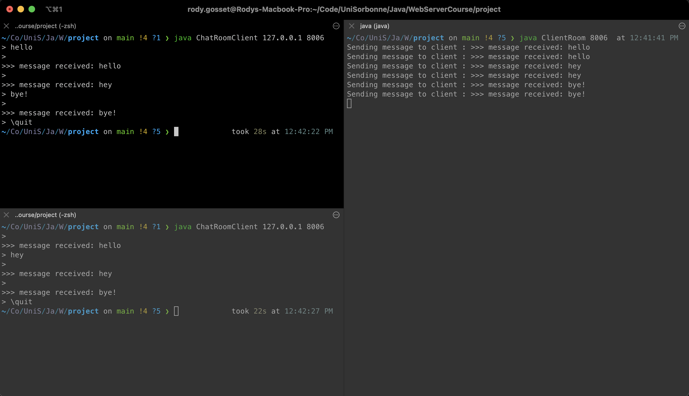

# Java Chat Room

Le but de ce projet était d'utiliser les `sockets` en Java  
afin de gérer de connections réseau avec des clients,  
et d'envoyer et recevoir des données.

Les exigences étaient les usivantes:  
> * À chaque fois que le serveur reçoit un message, celui-ci le diffuse à tous les clients connectés.
> * On ne veut pas que les messages des différents clients arrivent mélangés (début de la phrase d’un, puis phrase de l’autre, puis fin de phrase).
> * Améliorer le serveur pour qu’il efface un client de la liste quand celui-ci se déconnecte ou qu’il envoie "\quit".

Celles-cis ont été respectées.

# Utilisation

Avant toute chose, il faut que toutes les classes présentes dans ce projet soit compilées. 
*Voir la section sur la compilation.*

*De plus, naviguez depuis la ligne de commande dans le repertoire  
contenant les fichiers `.class`.*

Pour utiliser cette application, il est nécessaire que le serveur soit lancé.  
Pour cela, la ligne de commande est la suivante:

```
java ClientRoom <port number>
```

`<port number>` étant le numéro du port sur lequel le serveur va tourner.

Une fois le serveur lancé, on peut connecter un client de cette manière:  

```
java ChatRoomClient 127.0.0.1 <port number>
```

En effet, dans cet exemple, on fait tourner le serveur seulement en local.

Exemple d'utilisation:




# Compilation

Tout d'abords, placez-vous dans le repertoire  
contenant les fichier `.java`.

Après cela, simplement utiliser la commande suivante:

```
javac *.class
```

# Code source

Le code source est formatté clairement et commenté au maximum,  
pour que sa compréhension soit simple.

De plus, l'utilité de chaque classe est résumée  
au début du fichier `.java` correspondant.